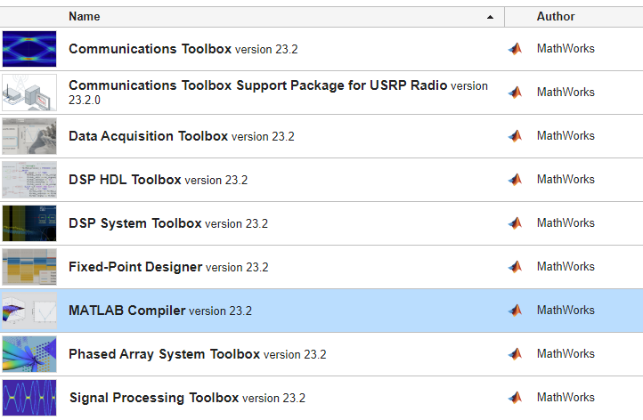
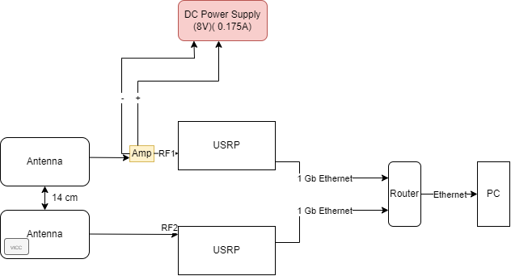

## ISO15693 with Software Defined Radio

## Open in a Markdown Viewer to see Images
### Auto Install Instructions

- Download the `Installer.exe` file for the MATLAB application.
- Run the installer, which will download the necessary MATLAB compiler, add-ons, and supporting function files.
- After installation, locate the program at `C:\Users\YourUserName\AppData\Roaming\ISO15693_USRP`.
- Navigate to the application folder and run `App.exe`.

**Note**: This should automatically install the required MATLAB compiler and add-ons to run the applicaiton. However, you will not be able to view or change the source code of the application, just of the addition function files. If this does not work then use the Manual Install Instruction.

### Manual Install

Follow these steps to run the application in MATLAB and access all the source code:

- Ensure you have the correct MATLAB Compiler installed (MATLAB R2023b).
- Install the following MATLAB Add-ons:
  
- Run the `App.mlapp` file to open the application.
- In the MATLAB window, right-click on the `Functions` folder and select `Add Path` -> `Selected Folder`.
- Now, you can double-click on `App.mlapp` to open the application editor. To view the source code go to `Code View` near the top right.

### USRP Setup

To ensure proper transmission and reception of data, follow these steps to set up two USRP devices (two N210 USRPs were used in this application):

1. Connect antennas to both USRP devices.
2. Connect both USRP devices to a router.
3. Ensure the router is connected to the user's computer.
4. To transmit a signal strong enough for an ISO15693 card, connect an amplifier to the transmitter antenna.

The complete setup diagram is provided below:

Configure the network in Windows:

- Go to `Control Panel` -> `Network and Internet` -> `Network and Sharing Center` -> `Change adapter settings` (on the left).
- Right-click on the Ethernet connection and select `Properties`.
- Double-click on `Internet Protocol Version 4`.
- Choose `Use the following IP address` and enter the router's IP address (192.168.10.1 in this case).
- Click `OK`.

**Note:** Disable Wi-Fi on the computer if necessary to prioritize the Ethernet connection.

To verify USRP connectivity and configuration, run the command `findsdru` in MATLAB. If two USRP devices are connected to the router, an empty field may indicate successful connection.

After completing the installation and USRP setup, the application should be ready for use.

### The Application

The following provides an overview of the application:

#### Data Options
- **Enter Sample Rate**: Set the sample rate of the transmitted data in MHz.
- **ASK %**: Adjust the percentage by which the waveform amplitude decreases in Amplitude Shift Keying.
- **Sine Wave Frequency**: Determine the frequency of the signal carrying the binary data.
- **Save Data**: Enable to save received samples into a `.mat` file at `C:\Users\YourName\Documents\ISO15693_USRP\Signals`.
- **Data Name**: Specify the name of the `.mat` file saved.

#### Time Scope Options
- **Plot Transmit Data**: Display a time scope of the transmitted data.
- **Plot Receive Data**: Display a time scope of the received data after reception.
- **Absolute Value**: Show the absolute value of the samples on the time scope.

#### USRP Options
- **Enter Transmitter Type**: Select the transmitter USRP from the dropdown.
- **Enter Receiver Type**: Select the receiver USRP from the dropdown.
- **Enter Transmitter IP Address**: Input the IP Address of the Transmitter USRP.
- **Enter Receiver IP Address**: Input the IP Address of the Receiver USRP.
- **Transmitter Fc**: Enter the Center Frequency of the Transmitter.
- **Receiver Fc**: Enter the Center Frequency of the Receiver.

#### Command Options
- **Enter Hex String**: Enter the binary data transmitted following the ISO15693 protocol.
- **Command**: Choose from a dropdown menu containing different commands sent to ISO15693 Cards.
- **Choose Transmit Type**: Select whether the Hex String is transmitted or the command is transmitted.

**Note**: Occasionally, an error may appear at the outset upon hitting the transmit button, even if the USRPs are correctly configured. Simply retrying a couple of times often resolves the issue, provided the devices are set up correctly.